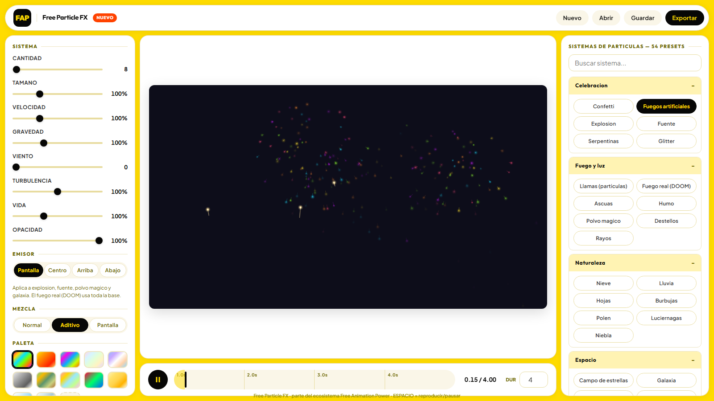
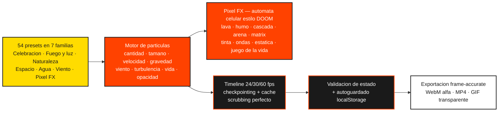

# Free Animation Power Particle FX
<p align="center">
  <a href="https://freeanimationpower.org"></a>
  <a href="https://www.youtube.com/@freeanimationpower"></a>
  <a href="https://github.com/freeanimationpower"></a>
</p>

<p align="center">
  
</p>

## 🎬 Videos

📺 Canal oficial: [@freeanimationpower](https://www.youtube.com/@freeanimationpower)

| Vídeo | Título |
|---|---|
| <a href="https://youtu.be/30ZA1AQjZwI"></a> | [Efectos de humo, fuego, nieve y confeti para tus escenas](https://youtu.be/30ZA1AQjZwI) |
| <a href="https://youtu.be/6ZgR7ANl--o"></a> | [Chispas, nieve y humo con pantalla verde: adiós a las búsquedas eternas](https://youtu.be/6ZgR7ANl--o) |

Estudio de sistemas de particulas (motion graphics) del ecosistema [Free Animation Power](https://freeanimationpower.org).

Genera efectos animados en el navegador con 54 sistemas editables en 7 familias: particulas clasicas, fuego real y efectos pixel (motores de automata celular estilo DOOM), agua, viento, naturaleza, espacio y celebracion. Exportacion a video con o sin transparencia.

## Demo en vivo

https://freeanimationpower.org/tools/particle-fx/

## Caracteristicas



- 54 sistemas en 7 familias: Celebracion, Fuego y luz, Naturaleza, Espacio, Agua, Viento y Pixel FX
- **Pixel FX (motor de automata celular estilo DOOM)**: lava, humo pixel, cascada pixel, arena pixel, lluvia pixel, matrix, tinta, ondas pixel, estatica TV, juego de la vida, viento pixel, plasma, aurora pixel, niebla pixel y nebulosa pixel — cada uno con reglas propias de celulas, paleta dinamica y bloom
- Juego de la vida con re-siembra periodica (gliders deterministicos) para evitar colapsos
- Ondas pixel con reflexion de bordes (vecinos espejo)
- Tinta con inyeccion continua senoidal para mantener el contraste
- Aurora y rayos conectados a la paleta global; rayos responden a viento y turbulencia
- **Filtro de pixelado global opcional** (320x180, bloques estilo DOOM) que unifica la estetica de partículas y automatas en preview y exportacion
- Fuego real DOOM precalentado (siempre encendido) con paleta dinamica
- Reglas directas (plasma, aurora pixel, niebla pixel, nebulosa pixel) calculadas por formula de tiempo: scrubbing perfecto
- Controles globales adaptativos: Cantidad y Emisor se ocultan en la familia Pixel FX
- Exportacion WebM (canal alfa), MP4 y GIF con transparencia, 24/30/60 fps, con duracion exacta
- Guardar y abrir proyectos JSON (.particlefx) con validacion de estado + autoguardado en localStorage
- Buscador de sistemas por nombre en el panel derecho

## Arquitectura de exportacion y cache

### Exportacion frame-accurate

El exportador de video usa dos caminos:

1. **requestFrame (preferido)**: el canvas se captura con `captureStream(0)` y cada frame se entrega explicitamente con `track.requestFrame()`. El video resultante tiene duracion y contenido exactos, sin depender de la velocidad de la CPU.
2. **Pacing con deadlines absolutos (fallback)**: en navegadores sin `requestFrame`, cada frame se renderiza y se espera hasta su deadline absoluto `start + i*(1000/fps)`. El uso de deadlines absolutos elimina el error acumulativo del metodo anterior basado en sleep.

El GIF no depende de tiempo real: se renderiza frame a frame con cesion de hilo (`await 0`).

### Checkpointing del timeline

Los automatas secuenciales (fuego DOOM y Pixel FX secuenciales) guardan instantaneas de su grilla cada 16 pasos en un cache Map por firma de simulacion (limite de 64 entradas, limpieza al cambiar parametros). Al retroceder en el timeline, el motor restaura la instantanea mas cercana y solo recalcula como maximo 16 pasos. Los efectos Pixel FX con doble buffer (tinta, ondas pixel, juego de la vida) guardan ambos buffers. La cache es memoizacion pura: no altera el determinismo de `hash32`.

### Validacion de estado

`sanitizeState(raw)` valida cualquier estado cargado (localStorage o archivo .particlefx): whitelist de claves, coerción numerica con limites, colores hex validos, preset existente y parametros por preset con sus minimos y maximos. Los proyectos antiguos o corruptos cargan con valores por defecto sin excepciones.

### Pixelado global

El interruptor "Pixelar salida" aplica un post-proceso al final de `render()`: el frame se reduce a 320x180 y se re-escala sin suavizado. Aplica por igual al preview y a los tres formatos de exportacion.
- Controles globales: cantidad, tamano, velocidad, gravedad, viento, turbulencia, vida y opacidad
- Parametros por sistema (altura y potencia de fuegos artificiales, torbellino del polvo magico, velocidad orbital de la galaxia, etc.)
- Emisor configurable: pantalla, centro, arriba o abajo
- 9 paletas de color + paleta personalizada con 5 colores
- Modos de mezcla: normal, aditivo y pantalla
- Estelas de movimiento activables, bucle, semilla reproducible y boton aleatorio
- Fondo activable o transparencia total (checkerboard en el escenario)
- Exportacion WebM (con canal alfa real), MP4 y GIF (con transparencia), 24/30/60 fps
- Guardar y abrir proyectos JSON (.particlefx) + autoguardado en localStorage
- Atajos: ESPACIO reproduce/pausa, clic en la linea de tiempo para scrubbing

## Correr localmente

Requiere PHP 7.4+ (el archivo PHP solo usa el email gate del ecosistema; todo el motor corre en el navegador):

```
php -S localhost:8000
```

Abrir http://localhost:8000/index.php

En localhost el email gate se omite automaticamente (bypass de desarrollo). En produccion protege la herramienta con la sesion de login del hub.

## Estructura

| Archivo | Uso |
|---------|-----|
| index.php | Version de produccion con email gate (Hostinger/PHP) |
| docs/index.html | Demo estatica identica, servida por GitHub Pages |

## Stack

HTML5 + CSS3 + Vanilla JS + Canvas 2D. Cero dependencias. Motor de render determinista por tiempo: cada particula se simula de forma analitica (fisica cerrada), por lo que la misma funcion dibuja el preview en vivo y cada frame de exportacion.
